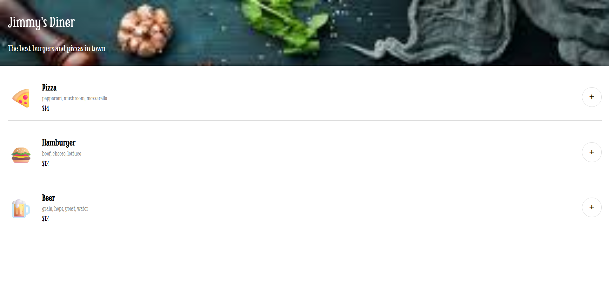
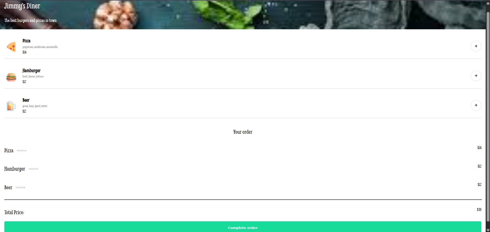
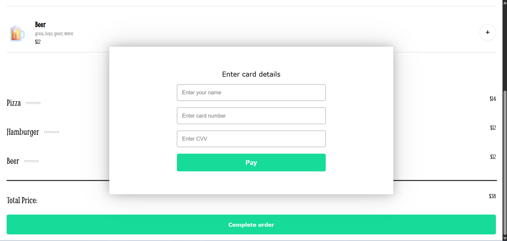

# Jimmy's Diner Ordering App

An interactive restaurant ordering web app where users can browse through a menu, add items to a cart, and complete an order through a modal payment form.

Live Demo: https://lucent-gnome-3cfa9b.netlify.app/

---

## Screenshots

## Features

- Browse through a menu of food and drinks

- Add and remove items from a cart

- Dynamic calculation of the total price

- Modal checkout form

- Order confirmation message after payment

- Accessible UI elements (ARIA roles and labels, semantic HTML)

---

## Tech stack

- HTML5

- CSS3

- Vanilla JavaScript (ES6+ Modules)

## What I learned

- Managing UI state without a framework

- Rendering dynamic content through JavaScript

- Event delegation and data attributes

- Handling modals and overlays

- Updating the DOM based on application state

- Debugging deployment issues (in Netlify)

---

## Future improvements

- Quantity controls for the cart

- Persist cart on reload through localStorage

- Keyboard navigation improvement

- possible dark mode toggle
